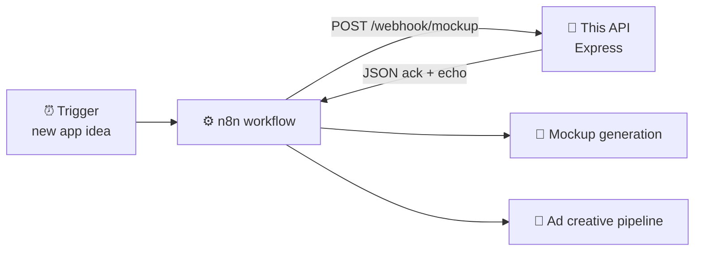

<div align="center">

# 🔗 N8N Mockups & Ads Workflow API

**A lightweight Express webhook service that connects n8n automations to the mockup and ads pipeline.**


</div>

---

## 💡 What it is

An early building block of the [App Validation System](https://github.com/scootero/App-Validation-System). This small API gives n8n workflows an HTTP endpoint to send mockup and ad-generation data to. It was a proof of concept for connecting automation to deployed services before the full WF0 to WF4 pipeline existed.

## 🔄 Where it fits



## 🛣️ Endpoints

| Method | Path | Purpose |
|---|---|---|
| `GET` | `/` | Health check that returns status and a timestamp |
| `POST` | `/webhook/mockup` | Receives `{ data }` from n8n, logs it and returns an acknowledgement |
| `GET` | `/api/test` | Connectivity test for n8n HTTP nodes |

```bash
curl -X POST http://localhost:3000/webhook/mockup \
  -H "Content-Type: application/json" \
  -d '{"data": {"appId": "human-lab", "stage": "mockup"}}'
```

## 🚀 Run locally

```bash
npm install
npm start          # http://localhost:3000
```

The app exports the Express `app` so it can also be deployed as a Vercel serverless function (`api/index.js`).

## 🧰 Tech

Node.js · Express · CORS · dotenv · n8n

---

<div align="center">

Built by **[Scott Oliver](https://github.com/scootero)**

</div>
